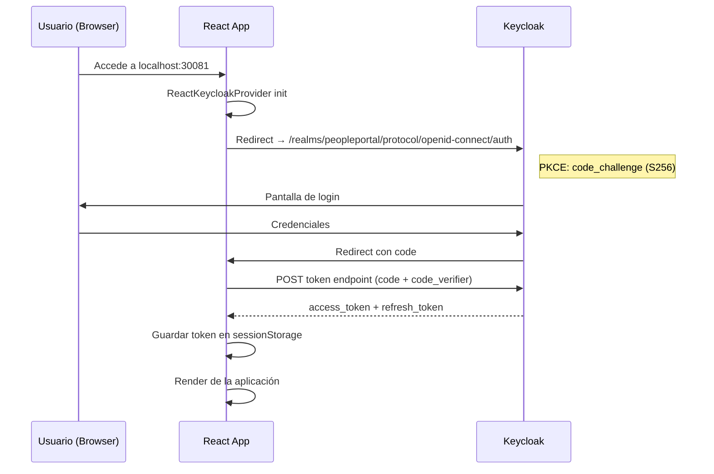

# Autenticación — FrontEnd Colaborador

## Flujo Keycloak PKCE S256



---

## Configuración Keycloak (`keycloak.js`)

```js
import Keycloak from 'keycloak-js';

const keycloak = new Keycloak({
  url:      import.meta.env.VITE_KEYCLOAK_URL || 'http://localhost:8080',
  realm:    'peopleportal',
  clientId: 'peopleportal-frontend',
});

export default keycloak;
```

---

## Inicialización en `App.jsx`

```jsx
<ReactKeycloakProvider
  authClient={keycloak}
  initOptions={{
    onLoad: 'login-required',
    pkceMethod: 'S256',
    checkLoginIframe: false,
  }}
>
  <App />
</ReactKeycloakProvider>
```

- `login-required`: redirige a Keycloak si no hay sesión activa.
- `pkceMethod: 'S256'`: habilita PKCE con SHA-256.
- `checkLoginIframe: false`: evita conflictos de CSP con el iframe de sesión.

---

## Interceptor Axios (Bearer token)

```js
// src/api/client.js
import axios from 'axios';
import keycloak from '../keycloak';

const client = axios.create({
  baseURL: import.meta.env.VITE_API_URL || '',
});

client.interceptors.request.use((config) => {
  const token = keycloak.token;
  if (token) {
    config.headers.Authorization = `Bearer ${token}`;
  }
  return config;
});

export default client;
```

Todos los requests a `/api/` incluyen automáticamente el JWT en el header `Authorization`.

---

## Almacenamiento del token

| Item | Valor |
|---|---|
| Clave en sessionStorage | `keycloak-token` |
| Scope | Session (se limpia al cerrar pestaña) |
| Refresh | Manejado automáticamente por `keycloak-js` |

---

## Logout

```js
keycloak.logout({ redirectUri: window.location.origin });
```

Invocado desde el botón de logout en el `Layout.jsx`.

---

## Realm y client de Keycloak

| Parámetro | Valor |
|---|---|
| Realm | `peopleportal` |
| Client ID | `peopleportal-frontend` |
| Client type | Public (sin secret) |
| Grant type | Authorization Code + PKCE |
| Rol requerido | `employee` (o `jefe_inmediato`) |
