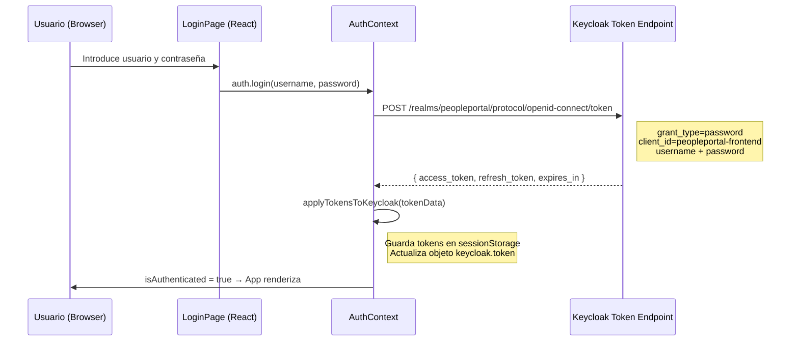

# Autenticación — FrontEnd Colaborador

## Mecanismo: ROPC directo a Keycloak (sin redirección)

El portal utiliza un formulario de login propio (React) que llama directamente al endpoint de token de Keycloak con el flujo **Resource Owner Password Credentials (ROPC)**. No se utiliza redirección PKCE ni `@react-keycloak/web`.



---

## Configuración `keycloak.js`

`keycloak.js` crea un objeto `Keycloak` como **proxy de token** para el interceptor Axios. **No se llama a `keycloak.init()`** — los tokens se inyectan manualmente desde `AuthContext`.

```js
// src/keycloak.js
import Keycloak from 'keycloak-js';

const keycloak = new Keycloak({
  url:      import.meta.env.VITE_KEYCLOAK_URL || 'http://localhost:30080',
  realm:    'peopleportal',
  clientId: 'peopleportal-frontend',
});

export default keycloak;
```

---

## Inicialización en `App.jsx`

```jsx
// src/App.jsx — No usa ReactKeycloakProvider
import { AuthProvider, useAuth } from './context/AuthContext';

function AppInner() {
  const { isAuthenticated, loading } = useAuth();
  if (loading) return null;
  if (!isAuthenticated) return <LoginPage />;
  return <Layout>...</Layout>;
}

export default function App() {
  return <AuthProvider><AppInner /></AuthProvider>;
}
```

---

## Interceptor Axios (Bearer token)

```js
// src/api/client.js
import axios from 'axios';
import keycloak from '../keycloak';

const client = axios.create({ baseURL: import.meta.env.VITE_API_URL || '' });

client.interceptors.request.use((config) => {
  if (keycloak.token) config.headers.Authorization = `Bearer ${keycloak.token}`;
  return config;
});

export default client;
```

---

## Almacenamiento del token

| Item | Valor |
|---|---|
| Clave access_token | `pp-colab-token` (sessionStorage) |
| Clave refresh_token | `pp-colab-refresh` (sessionStorage) |
| Scope | Session (se limpia al cerrar pestaña) |
| Refresh automático | `AuthContext` refresca antes de que expire |

---

## Logout

```js
auth.logout(); // Limpia sessionStorage y redirige al login
```

---

## Realm y client de Keycloak

| Parámetro | Valor |
|---|---|
| Realm | `peopleportal` |
| Client ID | `peopleportal-frontend` |
| Client type | Public (sin secret) |
| Grant type | **Resource Owner Password Credentials (ROPC)** |
| Rol requerido | `employee` (o `jefe_inmediato` para Mi Equipo) |

```js
keycloak.logout({ redirectUri: window.location.origin });
```

Invocado desde el botón de logout en el `Layout.jsx`.

---

## Realm y client de Keycloak

| Parámetro | Valor |
|---|---|
| Realm | `peopleportal` |
| Client ID | `peopleportal-frontend` |
| Client type | Public (sin secret) |
| Grant type | Authorization Code + PKCE |
| Rol requerido | `employee` (o `jefe_inmediato`) |
